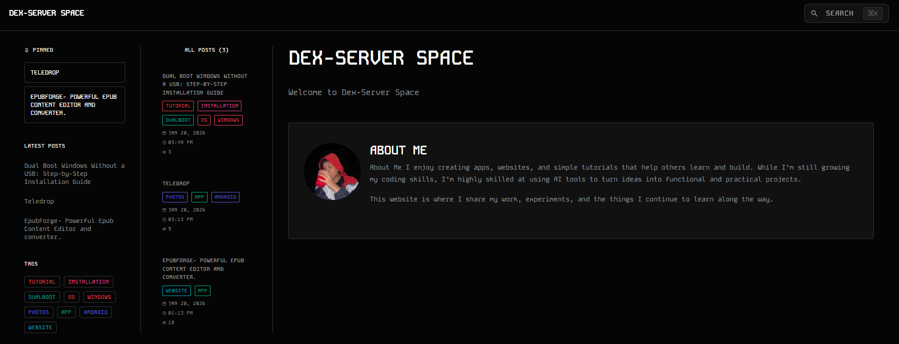

<h2 align="center">Hi, I’m Rainiel 👋</h2>

DevOps • IT • Vibe Coder

  <a href="https://dex-server.space">Website</a> ·
  <a href="https://github.com/rrrainielll">GitHub</a> ·
  <a href="mailto:rainielmontanez@dex-server.space">Email</a>

---

### About Me
I build apps, websites, and simple tutorials to help others learn and ship faster.  
I use AI tools to turn ideas into practical projects while continuously improving my skills.

**Main hub:** https://dex-server.space
<!-- Banner -->

  

