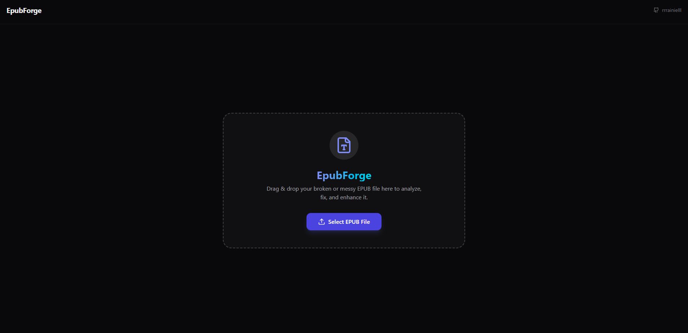

<!-- Banner / Hero -->

  

<h1 align="center">Hi, I’m Rainiel 👋</h1>

  Customer Service Representative • IT • Builder of practical apps & tools

  🌐 <a href="https://dex-server.space">dex-server.space</a> • 
  🧰 <a href="https://github.com/rrrainielll">GitHub</a> •
  📩 <a href="mailto:your-email@example.com">your-email@example.com</a>

---

## About Me
I build apps, websites, and simple tutorials that help others learn and ship faster.  
I use AI tools to turn ideas into functional and practical projects — and I’m continuously improving my coding skills along the way.

**Main hub:** https://dex-server.space

---

## Featured Works
### 📚 EpubForge — EPUB Validator, Fixer, and Converter
A web app created because Google Play Books wouldn’t process some EPUB uploads.  
EpubForge helps validate and fix EPUB files so they work properly with Google Play Books and other readers, with conversion support too.

**Links**
- Website/Info: https://dex-server.space (add your EpubForge post link)
- Repo: (add repo link here)

**Preview**

  

---

### 📲 Teledrop
A simple app concept/tool for sharing or transferring files/media (add your exact description).

**Links**
- Post: https://dex-server.space (add Teledrop post link)
- Repo: (add repo link here)

**Preview**

  

---

### 🖥️ Dual Boot Windows Without a USB — Step-by-Step Guide
A tutorial-style guide focused on installing/setting up Windows dual boot without needing a USB (add your exact scope).

**Links**
- Guide: https://dex-server.space (add the post link)
- Notes/Repo (optional): (add link)

---

## Links
- 🌐 Website: https://dex-server.space
- 🧾 Blog/Posts: https://dex-server.space (or your posts page)
- 🧠 Projects: (your GitHub projects page link)
- 📬 Contact: your-email@example.com

---

## What I’m Working On
- Improving EpubForge features and UI/UX  
- Building more practical tools for creators and PC users  
- Writing clear, beginner-friendly tutorials

---

  Built with curiosity, consistency, and a bit of AI.

